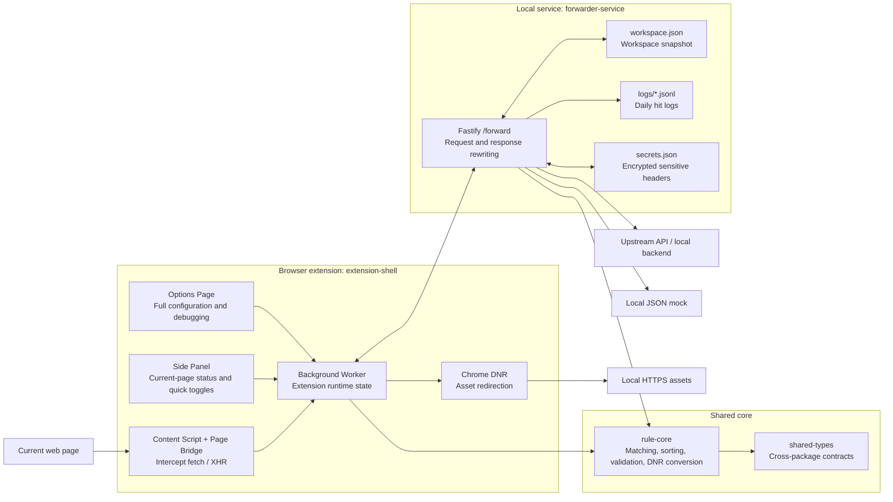
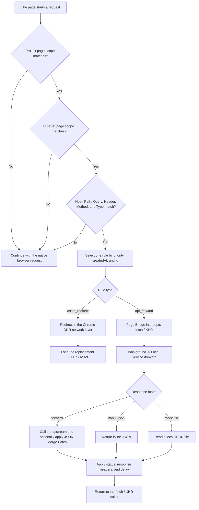

# Resource Forwarder

English | [简体中文](README.zh-CN.md)

A browser-based local proxy toolkit for frontend development. Resource Forwarder combines a Manifest V3 extension with a local Fastify service so developers can replace static assets, forward APIs, modify real responses, or return JSON mocks without changing application source code.

## Core capabilities

| Capability | Typical use case | Execution layer |
| --- | --- | --- |
| Asset replacement | Replace remote JavaScript, CSS, images, or fonts with local builds | Chrome DNR network layer |
| API forwarding | Route `fetch` / `XMLHttpRequest` calls to a local or alternate environment | Page Bridge + local service |
| Response modification | Keep the real upstream request while changing JSON, status, or headers | Local service |
| JSON mocking | Skip the upstream and return inline JSON or a local `.json` file | Local service |
| Scoped rules | Control activation by project, rule set, request conditions, and priority | `rule-core` |
| Debugging and management | Inspect matches, hit logs, DNR state, and workspace imports/exports | Options Page / Side Panel |

Resource Forwarder is useful when you need to:

- replace a test environment bundle with a local JavaScript or CSS build;
- forward a shared environment API to a backend running on your machine;
- develop loading, empty, success, and error states with deterministic responses;
- patch selected fields in a real API response while preserving everything else;
- keep proxy rules isolated across sites, pages, and sub-applications.

## Quick start

### Requirements

- Node.js 20 or newer
- pnpm 9
- Chrome or Edge

### Install and run

```bash
pnpm install
pnpm dev
```

`pnpm dev` starts both:

- the local forwarding service at `http://127.0.0.1:5178`;
- the extension watch build, written to `packages/extension-shell/dist`.

### Load the extension

1. Open `chrome://extensions` or `edge://extensions`.
2. Enable Developer mode.
3. Choose **Load unpacked**.
4. Select `packages/extension-shell/dist`.

### Configure the service token once

Every local service endpoint except `/health` requires a bearer token. On startup, the service prints the token file path:

```text
[forwarder-service] auth token file: <storage_root>/token
```

The default storage root is `.resource-forwarder` under the directory where the service was started. When `pnpm dev` is run from the repository root, the path is normally:

```text
<repository>/.resource-forwarder/token
```

Copy the complete file contents, then open:

```text
Settings -> General settings -> Service token
```

The token is stored in `chrome.storage.local`, so restarting the service or browser normally does not require configuring it again.

### Create the first rules

Choose either approach:

1. Create a project, rule set, and rules in the Options Page.
2. Import [`examples/sample-workspace.yaml`](examples/sample-workspace.yaml) from the Import / Export page.

Open the target website and the extension Side Panel to inspect the projects, rule sets, and rules that match the current page.

## System architecture



The package dependency direction remains one-way:

```text
shared-types -> rule-core -> extension-shell / forwarder-service
```

## Request execution flow



## Core concepts

### Project

A project defines the pages on which its rules may run. `siteMatchPatterns` applies to the current browser page URL, not the request destination.

Example:

```text
https://app.example.com/tables/*
```

### RuleSet

A rule set belongs to one project and groups rules for organization and bulk enable/disable operations. It may define a narrower page scope; otherwise it inherits its project scope.

### Rule

Every rule must belong to exactly one rule set. Supported rule types are:

- `asset_redirect` for static asset replacement;
- `api_forward` for API forwarding, response modification, and mocks.

Orphaned rules, duplicate memberships, and rule sets with missing projects remain visible for repair but do not participate in execution.

## Matching and priority

A rule must pass every layer:

1. The current page matches the Project page scope.
2. The current page matches the RuleSet page scope, or the RuleSet inherits the Project scope.
3. The request matches Host, Path, Query, Header, Method, Resource Type, and Tab Scope conditions.
4. When several rules pass, the engine selects one deterministic winner.

Stable rule order:

1. `priority` descending;
2. `createdAt` ascending;
3. `id` ascending.

### `pathGlob` syntax

| Pattern | Meaning | Example |
| --- | --- | --- |
| `*` | Matches characters within one path segment and does not cross `/` | `/assets/*.js` |
| `**` | Matches nested path segments and may cross `/` | `/api/**` |
| `?` | Matches one character | `/api/user-?` |

Project page scope and rule Host serve different purposes:

```text
Project page scope: where the rule is active
Rule Host: which destination host is intercepted
```

## Asset replacement: `asset_redirect`

Asset rules are converted into Chrome dynamic DNR rules when the workspace is saved:

```text
Options Page
  -> Background Worker
  -> rule-core DNR conversion
  -> chrome.declarativeNetRequest
  -> browser network-layer redirect
```

The conversion maps:

- `match.host` to `requestDomains`;
- `pathGlob` to `urlFilter` or `regexFilter`;
- Project `siteHosts` to `initiatorDomains`;
- `resourceType` to DNR resource type conditions.

This prevents one project's asset rules from affecting unrelated pages. Only global projects with empty `siteHosts` or `*` skip the `initiatorDomains` restriction.

Redirect targets must be browser-reachable HTTPS URLs.

## API forwarding: `api_forward`

### Request matching

API rules can combine:

- destination Host;
- path glob;
- Query parameters;
- request headers;
- HTTP Method;
- `fetch` / `xmlhttprequest` type;
- Tab Scope.

### Request rewriting

- Change the upstream `targetBaseUrl`.
- Remove a path prefix with `stripPrefix`.
- Apply ordered path-prefix rewrites through `pathRewrite`.
- Remove, set, or append Query parameters.
- Strip, pass through, inject, or override request headers.
- Configure a per-rule timeout.

### Cookie forwarding

Same-host forwarding can supplement browser cookies, including HttpOnly cookies that page JavaScript cannot read.

Cross-host forwarding does not include cookies by default. Add `cookie` to the header passthrough list only when the target explicitly requires it.

### Response modes

#### Forward: `forward`

Call the real upstream and optionally modify the result:

- apply an RFC 7396-style JSON Merge Patch;
- override status and status text;
- strip, inject, or override response headers;
- add a deterministic `0-30000ms` delay.

In a Merge Patch, `null` removes the corresponding field.

#### Inline JSON: `mock_json`

Skip the upstream and return JSON stored directly in the rule. This is useful for success, empty, and error-state development.

#### Local file: `mock_file`

Skip the upstream and read a `.json` file through the local service.

Paths may be absolute or relative to the working directory from which the forwarder service was started. Files must contain valid JSON and may not exceed 4 MiB.

### Failure behavior

Each API rule can choose:

- `native`: retry the original browser request when the service is offline, streaming is unsupported, or request/response limits are exceeded;
- `error`: block native fallback and surface an error to the page.

For local API development, `error` is recommended to prevent an unavailable local service from silently sending requests to a shared test or production environment.

## User interfaces

### Options Page

The full workspace provides:

- Project, RuleSet, and Rule CRUD.
- Project duplication, RuleSet duplication, Rule duplication, and cross-project copying.
- JSON and YAML import/export.
- Request match diagnostics and final target URL previews.
- Service URL, token, and advanced settings.
- Recent hit logs and configuration warnings.

### Side Panel

The Side Panel is scoped to the current page:

- inspect matching projects, rule sets, and rules;
- quickly enable or disable projects, rule sets, and rules;
- inspect service status, the current URL, and registered DNR counts;
- use **View matching rules** to open the Options Page at the matching project and rule set;
- reuse an existing Options tab instead of creating duplicate workspaces.

## Data and security

Default storage directory:

```text
<working-directory>/.resource-forwarder
```

Override it with:

```bash
RF_STORAGE_ROOT=/custom/path pnpm dev:service
```

Stored files:

| File | Purpose |
| --- | --- |
| `workspace.json` | Current workspace snapshot |
| `token` | Local service authentication token |
| `logs/YYYY-MM-DD.jsonl` | Daily hit logs |
| `secrets.json` | Encrypted sensitive headers |
| `secret.key` | Local AES-256-GCM encryption key |

Sensitive headers such as `Authorization`, `Cookie`, and `X-API-Key` are encrypted at rest with permissions restricted to the current user.

Workspace exports contain decrypted header values and local mock file paths for portability. Review and remove sensitive values before sharing exported JSON or YAML.

To restrict CORS to one extension build, set:

```bash
RF_EXTENSION_ID=<your-extension-id> pnpm dev:service
```

## Workspace packages

| Package | Responsibility |
| --- | --- |
| `packages/shared-types` | Cross-package TypeScript contracts |
| `packages/rule-core` | Workspace parsing, matching, conflict checks, and DNR conversion |
| `packages/forwarder-service` | Fastify service, persistence, proxying, and logs |
| `packages/extension-shell` | Background Worker, Page Bridge, Options Page, and Side Panel |

## Commands

```bash
pnpm dev            # Local service + extension watch build
pnpm dev:service    # Local service only
pnpm dev:extension  # Extension watch build only
pnpm start          # Run the built local service
pnpm build          # Build all workspace packages
pnpm test           # Run all tests
```

Package-level tests:

```bash
pnpm --filter @resource-forwarder/rule-core test
pnpm --filter @resource-forwarder/forwarder-service test
pnpm --filter @resource-forwarder/extension-shell test
```

## Current boundaries

- API forwarding intercepts page-context `fetch` and `XMLHttpRequest` only.
- WebSocket and transparent HTTPS MITM are out of scope for the current version.
- The extension does not request `chrome.debugger` permission.
- Forwarded request bodies are limited to approximately 2 MiB in the page bridge.
- SSE `text/event-stream` and responses larger than approximately 4 MiB cannot be buffered through extension messaging.
- JSON Merge Patch requires a valid JSON upstream response; parsing failures surface as proxy errors.
- Asset replacement requires a browser-reachable HTTPS target.

## Validation

Run before submitting changes:

```bash
pnpm build
pnpm test
git diff --check
```
