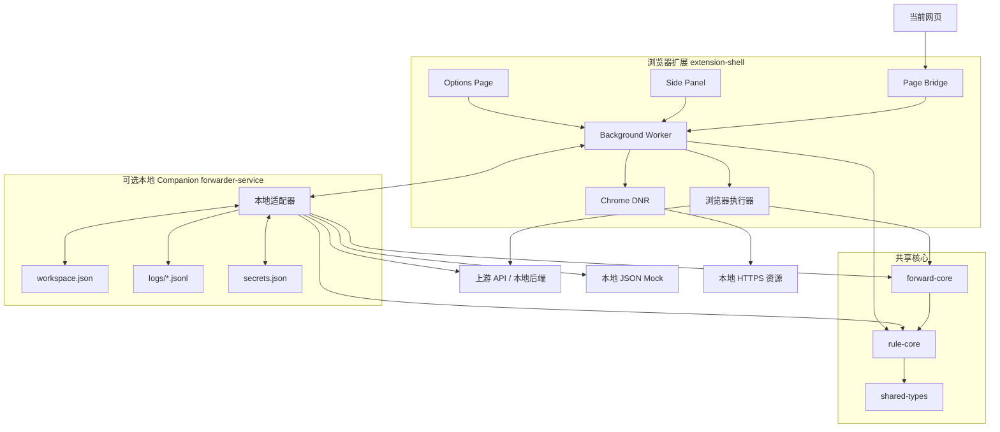
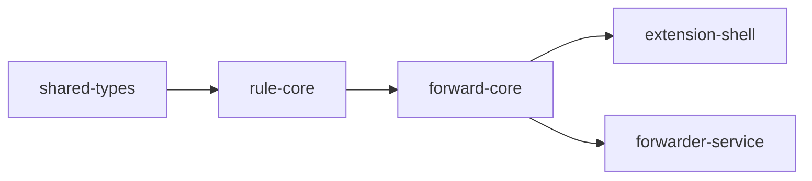
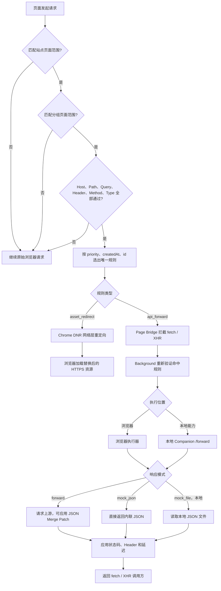
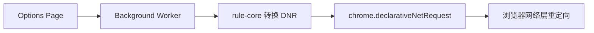

# Resource Forwarder

[English](README.md) | 简体中文

面向前端开发的浏览器优先代理工具。普通 API 转发和响应修改直接由 Manifest V3 扩展完成；可选的本地 Companion 负责文件系统与浏览器受限能力。

## 核心能力

| 能力 | 适用场景 | 执行位置 |
| --- | --- | --- |
| 资源替换 | 将线上 JS、CSS、图片或字体替换为本地构建产物 | Chrome DNR 网络层 |
| API 转发 | 将 `fetch` / `XMLHttpRequest` 请求转发到本地或其他环境 | 默认由 Extension Service Worker 执行 |
| 响应修改 | 保留真实上游请求，同时修改 JSON、状态码和响应 Header | 浏览器或 Companion 共用 `forward-core` |
| JSON Mock | 不访问上游，返回内联 JSON 或本地 `.json` 文件 | 内联 JSON 走浏览器，任意路径走 Companion |
| 规则分层 | 按站点、分组、请求条件和优先级控制规则生效范围 | `rule-core` |
| 调试与管理 | 查看匹配结果、命中日志、DNR 状态，并导入导出工作区 | Options Page / Side Panel |

适合以下开发流程：

- 用本地 bundle 临时替换测试环境中的 JS 或 CSS。
- 将测试环境 API 转发到本机后端。
- 构造接口成功、空数据、异常和延迟状态。
- 修改真实接口的部分字段，同时保留其余响应内容。
- 为不同站点、页面和子应用维护相互隔离的代理规则。

## 快速开始

### 环境要求

- Chrome 或 Edge
- 构建扩展或使用可选 Companion 时需要 Node.js 20+ 与 pnpm 9

### 安装并启动

```bash
pnpm install
pnpm dev
```

`pnpm dev` 会启动扩展构建和可选 Companion，适合完整开发：

- 本地转发服务：`http://127.0.0.1:5178`
- 扩展 watch 构建：输出到 `packages/extension-shell/dist`

### 加载浏览器扩展

1. 打开 `chrome://extensions` 或 `edge://extensions`。
2. 开启开发者模式。
3. 点击“加载已解压的扩展程序”。
4. 选择 `packages/extension-shell/dist`。

### 可选：配置 Companion token

普通转发、响应修改和内联 JSON Mock 不要求启动 Companion。任意本地文件、浏览器受限 Header 或显式 `executionMode: local` 的规则才需要它。除 `/health` 外，Companion 接口都要求 Bearer Token，首次启动时终端会打印 token 文件路径：

```text
[forwarder-service] auth token file: <storage_root>/token
```

默认存储目录是当前启动目录下的 `.resource-forwarder`，因此在仓库根目录执行 `pnpm dev` 时通常为：

```text
<repository>/.resource-forwarder/token
```

复制文件中的完整内容，然后进入扩展：

```text
设置 -> 通用设置 -> 服务 token
```

保存一次后，token 会存入 `chrome.storage.local`，重启服务或浏览器通常不需要重新填写。

### 创建第一组规则

可以选择以下任一方式：

1. 在 Options Page 创建站点、分组和规则。
2. 在“导入导出”页面导入 [`examples/sample-workspace.yaml`](examples/sample-workspace.yaml)。

随后打开目标网页和扩展 Side Panel，即可查看当前页面命中的站点、分组和生效规则。

## 系统架构



代码依赖方向保持单向：



## 一次请求如何执行



## 核心概念

### Project 站点

站点控制规则在哪些页面生效。`siteMatchPatterns` 匹配的是当前浏览器页面 URL，而不是请求目标地址。

示例：

```text
https://app.example.com/tables/*
```

### RuleSet 分组

分组属于一个站点，用于组织和批量启停规则。分组可以配置更窄的页面范围；未配置时继承所属站点。

### Rule 规则

规则必须唯一归属于一个分组。当前支持：

- `asset_redirect`：资源替换。
- `api_forward`：API 转发、响应修改和 Mock。

未归组、重复归组或所属站点缺失的规则会保留在界面中供修复，但不会参与执行。

## 匹配与优先级

规则必须依次通过以下层级：

1. 当前页面匹配 Project 页面范围。
2. 当前页面匹配 RuleSet 页面范围，或分组继承 Project 范围。
3. 请求匹配规则的 Host、Path、Query、Header、Method、Resource Type 和 Tab Scope。
4. 多条规则同时通过时，选出唯一规则。

稳定排序规则：

1. `priority` 降序。
2. `createdAt` 升序。
3. `id` 升序。

### `pathGlob` 语法

| 通配符 | 含义 | 示例 |
| --- | --- | --- |
| `*` | 匹配单层字符，不跨 `/` | `/assets/*.js` |
| `**` | 匹配任意层级路径，可跨 `/` | `/api/**` |
| `?` | 匹配一个字符 | `/api/user-?` |

站点页面范围与规则 Host 的职责不同：

```text
站点页面范围：规则在哪些页面上启用
规则 Host：拦截页面发出的哪个目标域名请求
```

## 资源替换 `asset_redirect`

资源替换会在保存工作区时转换为 Chrome 动态 DNR 规则：



规则会将：

- `match.host` 转换为 `requestDomains`。
- `pathGlob` 转换为 `urlFilter` 或 `regexFilter`。
- Project 的 `siteHosts` 转换为 `initiatorDomains`。
- `resourceType` 转换为 DNR 资源类型条件。

这能避免某个站点的资源规则泄漏到无关页面。只有 `siteHosts` 为空或包含 `*` 的全局站点不会绑定 `initiatorDomains`。

目标地址必须是浏览器能够访问的 HTTPS URL。

## API 转发 `api_forward`

### 请求匹配

API 规则可以按以下条件组合匹配：

- 请求 Host
- 路径通配符
- Query 参数
- 请求 Header
- HTTP Method
- `fetch` / `xmlhttprequest` 类型
- Tab Scope

### 请求改写

- 替换上游基础地址 `targetBaseUrl`。
- 移除路径前缀 `stripPrefix`。
- 按顺序执行路径前缀改写 `pathRewrite`。
- 删除、设置或追加 Query 参数。
- 删除、透传、注入或覆盖请求 Header。
- 配置单条规则的超时时间。

### Cookie 转发

浏览器执行器会在 Chrome 允许时携带目标 Host 自身的浏览器凭据。将源站 Cookie（包括 HttpOnly Cookie）搬到其他目标属于浏览器受限能力，`auto` 模式会自动切换到本地 Companion。

跨 Host 转发默认不会携带 Cookie。如确有需要，可在 Header 透传列表中明确加入 `cookie`。

### 响应模式

#### 真实转发 `forward`

请求真实上游，并可继续修改返回结果：

- 应用 RFC 7396 风格的 JSON Merge Patch。
- 覆盖状态码与状态描述。
- 删除、注入或覆盖响应 Header。
- 增加 `0-30000ms` 固定延迟。

Merge Patch 中的 `null` 表示删除对应字段。

#### 内联 JSON `mock_json`

不请求上游，直接返回规则中配置的 JSON。适合快速构造成功、空数据和错误状态。

#### 本地文件 `mock_file`

不请求上游，由本地服务读取指定 `.json` 文件作为响应。

文件路径可以是绝对路径，也可以相对于启动 forwarder service 时的工作目录。只接受合法 `.json` 文件，最大 4 MiB。

### 执行位置

每条 API 规则支持 `auto`、`browser`、`local`。默认 `auto`：普通转发、响应修改和内联 Mock 由扩展 Service Worker 执行；任意文件路径和受限 Header 自动使用 Companion。`browser` 遇到本地专属能力会明确报错，`local` 则始终使用 Companion。

### 失败策略

每条 API 规则可以选择：

- `native`：所选执行器不可用、流式响应或请求体/响应体超限时，回到原始浏览器请求。
- `error`：禁止回源，直接向页面暴露错误。

写接口开发建议使用 `error`，避免执行器不可用时意外请求共享测试或生产环境。

## 界面说明

### Options Page

完整工作台提供：

- 站点、分组和规则 CRUD。
- 复制站点、复制分组、复制规则和跨站点复制。
- JSON / YAML 导入导出。
- 请求匹配诊断与最终目标地址预览。
- 服务地址、token 和高级设置。
- 最近命中日志与配置告警。

### Side Panel

侧边栏聚焦当前页面：

- 展示命中的站点、分组和规则。
- 快速启停站点、分组和规则。
- 显示服务状态、当前 URL 和实际注册的 DNR 数量。
- 点击“查看命中规则”时，自动打开并定位到对应站点和分组。
- 复用已经打开的 Options 标签页，避免重复创建工作台。

## 数据与安全

默认存储目录：

```text
<working-directory>/.resource-forwarder
```

可以通过环境变量修改：

```bash
RF_STORAGE_ROOT=/custom/path pnpm dev:service
```

目录内容：

| 文件 | 用途 |
| --- | --- |
| `workspace.json` | 当前工作区快照 |
| `token` | 本地服务鉴权 token |
| `logs/YYYY-MM-DD.jsonl` | 每日命中日志 |
| `secrets.json` | 加密后的敏感 Header |
| `secret.key` | AES-256-GCM 本地加密密钥 |

`Authorization`、`Cookie`、`X-API-Key` 等敏感 Header 会加密存储，文件权限限制为当前用户读取。

工作区导出为了便于迁移，会包含解密后的明文 Header 和本地 Mock 文件路径。分享导出文件前请先检查并移除敏感内容。

如需将 CORS 限制到当前扩展，可以启动服务前设置：

```bash
RF_EXTENSION_ID=<your-extension-id> pnpm dev:service
```

## Workspace 包结构

| Package | 职责 |
| --- | --- |
| `packages/shared-types` | 跨包 TypeScript 数据契约 |
| `packages/rule-core` | 工作区解析、规则匹配、冲突检查和 DNR 转换 |
| `packages/forward-core` | 跨运行时请求转发与响应策略执行 |
| `packages/forwarder-service` | Fastify 本地服务、持久化、代理和日志 |
| `packages/extension-shell` | Background、Page Bridge、Options Page 和 Side Panel |

## 常用命令

```bash
pnpm dev            # 本地服务 + 扩展 watch 构建
pnpm dev:service    # 只启动本地服务
pnpm dev:extension  # 只启动扩展 watch 构建
pnpm start          # 启动已构建的本地服务
pnpm build          # 构建全部 workspace package
pnpm test           # 运行全部测试
```

Package 级命令：

```bash
pnpm --filter @resource-forwarder/rule-core test
pnpm --filter @resource-forwarder/forward-core test
pnpm --filter @resource-forwarder/forwarder-service test
pnpm --filter @resource-forwarder/extension-shell test
```

## 当前边界

- API 转发只拦截页面上下文中的 `fetch` 和 `XMLHttpRequest`。
- WebSocket 和透明 HTTPS MITM 不在当前版本范围内。
- 扩展不会申请 `chrome.debugger` 权限。
- 页面侧可转发的请求体上限约为 2 MiB。
- SSE `text/event-stream` 和超过约 4 MiB 的响应无法通过扩展消息完整缓冲。
- JSON Merge Patch 要求上游响应是合法 JSON，否则返回代理错误。
- 资源替换要求目标是浏览器可访问的 HTTPS 地址。

## 验证

提交改动前建议运行：

```bash
pnpm build
pnpm test
git diff --check
```
